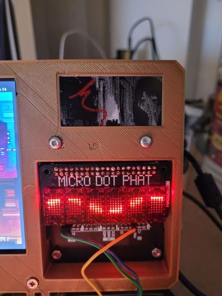

# eInk images

Testing with 2 layers, a black and a red one

>  I use this command to generate the bmp files `magick .\your_image.jpg -dither FloydSteinberg -define dither:diffusion-amount=85% -remap .\eink3color.png BMP3:your_image.bmp`
